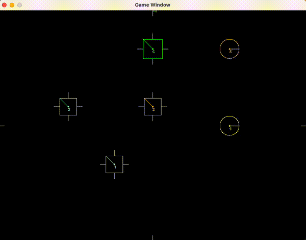

# Physics Engine

A 2D rigid body physics engine written in C++, built from scratch
using SDL2 for rendering.

## What it simulates

- Elastic collisions between rigid bodies with mass and restitution
- Impulse-based collision resolution conserving linear momentum
- Penetration correction to prevent body overlap
- Static bodies (immovable walls and obstacles)
- Optional gravity mode

Collision detection supports circle-circle, circle-polygon, and
polygon-polygon pairs. Polygon detection uses the Separating Axis
Theorem (SAT). Collision dispatch uses a visitor pattern to route
shape-pair combinations without type casting.

## Architecture

| Module | Responsibility |
|---|---|
| `engine` | Main loop, integration, scene setup |
| `collision` | Detection and resolution |
| `rigid_body` | Mass, velocity, inertia |
| `graphics` | SDL2 rendering, shapes |
| `vector` | 2D vector math |
| `material` | Restitution, physical properties |
| `input_manager` | Keyboard input |
| `utils` | Shared utilities |

## Controls

**Body A — Arrow keys**

| Key | Action |
|---|---|
| ← → ↑ ↓ | Move |
| , / . | Rotate left / right |

**Body B — WASD**

| Key | Action |
|---|---|
| A D W S | Move |
| Q / E | Rotate left / right |

**System**

| Key | Action |
|---|---|
| F1 | Reset all positions and velocities |
| F2 | Toggle pass-through mode (disable collision resolution) |
| F3 | Toggle debug overlay (forces, manifold visualization) |
| F4 | Toggle gravity |
| Escape | Quit |

## Current scope

Linear collision resolution is fully implemented. Rotational
dynamics (angular impulse, moment of inertia) are partially
implemented and will be activated in a future iteration.

## Build

Requires SDL2.
```bash
make
```

Tested on macOS. Should work on any POSIX-compliant system.

## Preview



## References

- Impulse resolution: [Chris Hecker — Rigid Body Dynamics](https://www.chrishecker.com/Rigid_Body_Dynamics)
- Collision detection: [Newcastle University — Physics Tutorial](https://research.ncl.ac.uk/game/mastersdegree/gametechnologies/previousinformation/physics4collisiondetection/2017%20Tutorial%204%20-%20Collision%20Detection.pdf)
- Visitor pattern: [Refactoring Guru — Visitor in C++](https://refactoring.guru/design-patterns/visitor/cpp/example)
- Polygon centroid: [Wikipedia — Polygon](https://en.wikipedia.org/wiki/Centroid#Of_a_polygon)